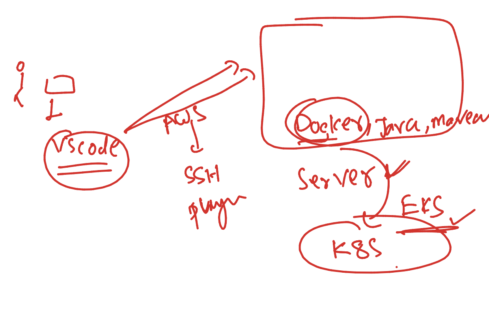

# JPMC-sparkawsEKS

### Spark introduction  


### spark with contaienrs 


### lab setup 



### to test connection from windows powershell

```
 ssh   ashu@18.215.115.28
```

### creating directory in remtoe server

```
[ashu@ip-172-31-95-164 ~]$ mkdir   ashu-java-spark 
[ashu@ip-172-31-95-164 ~]$ mkdir   ashu-java-spark/javacode 
[ashu@ip-172-31-95-164 ~]$ mkdir   ashu-java-spark/sparkcode
[ashu@ip-172-31-95-164 ~]$ 
[ashu@ip-172-31-95-164 ~]$ ls  ashu-java-spark/
javacode  sparkcode
[ashu@ip-172-31-95-164 ~]$ 

```

