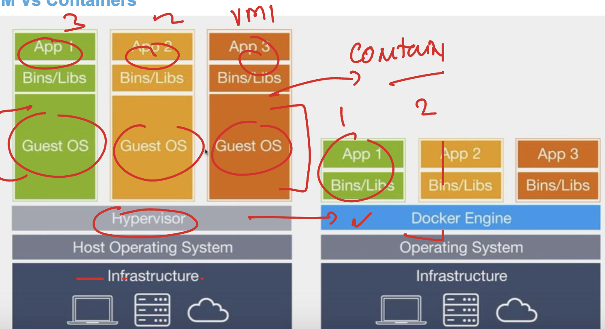
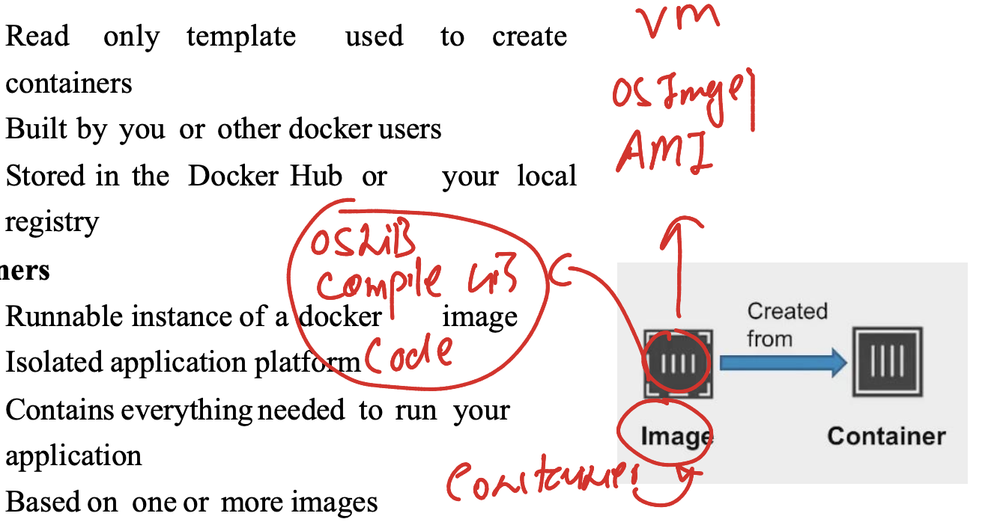
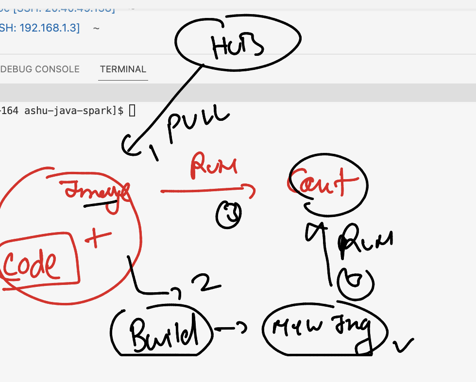
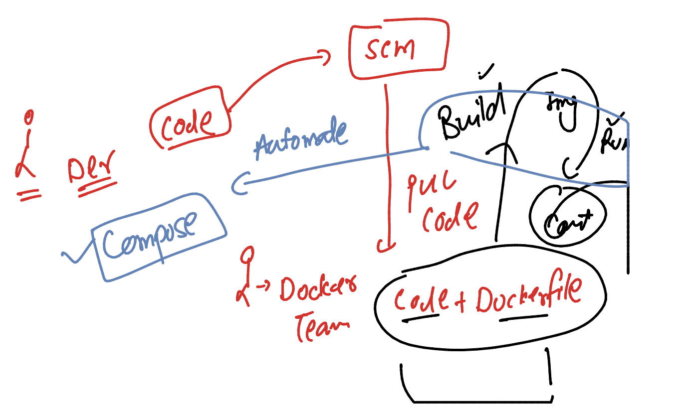
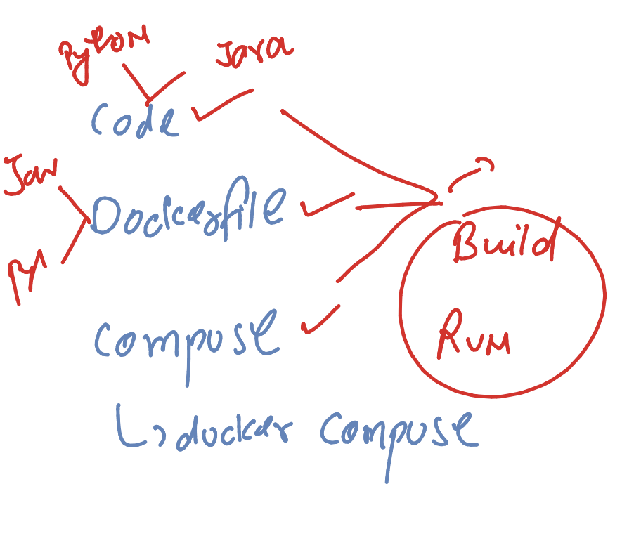
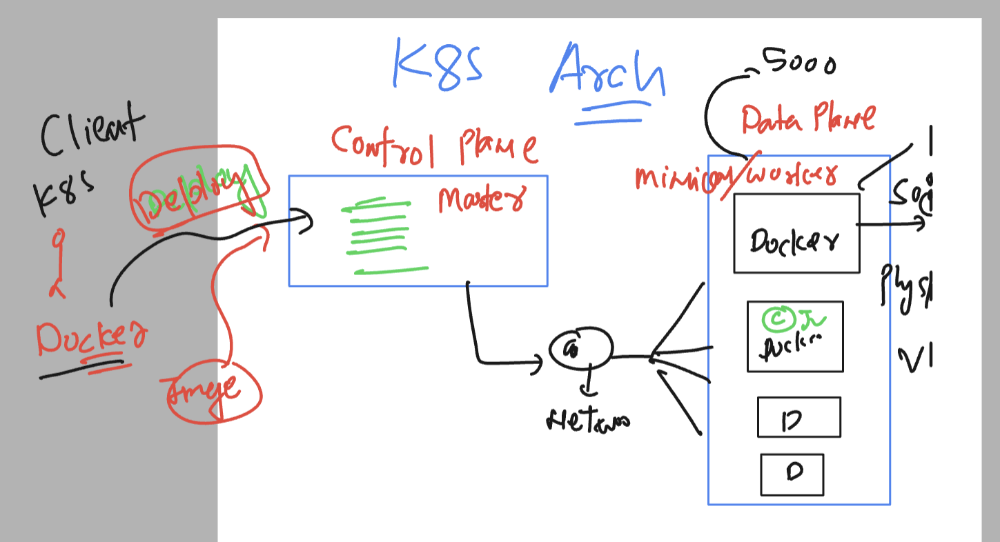
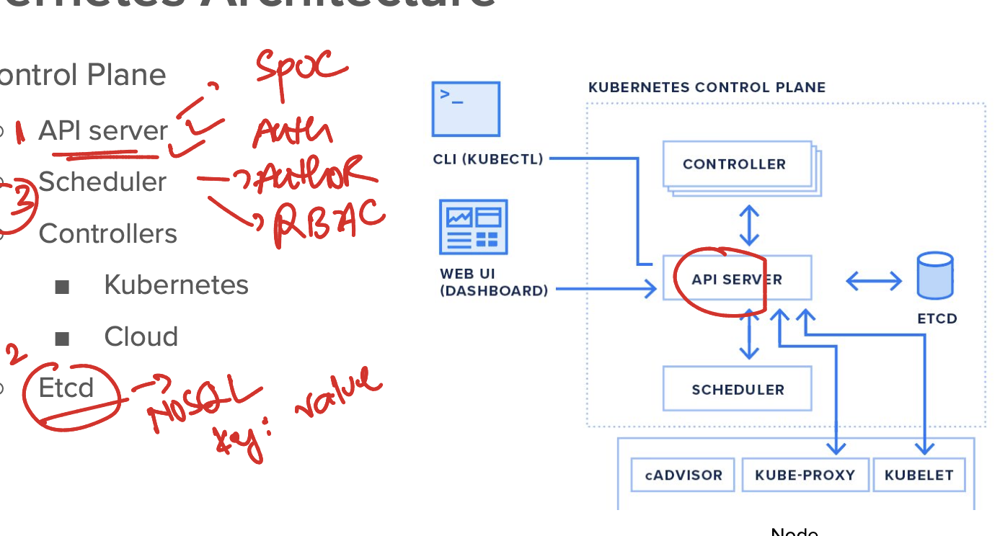
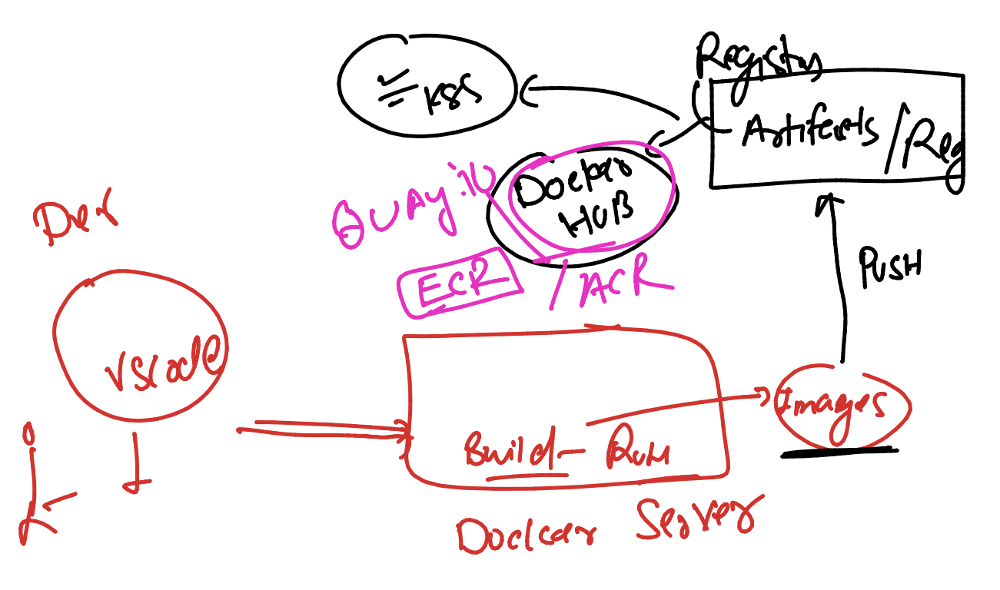

# JPMC-sparkawsEKS

### Spark introduction  


### spark with contaienrs 


### lab setup 


### to test connection from windows powershell

```
 ssh   ashu@18.215.115.28
```

### creating directory in remtoe server

```
[ashu@ip-172-31-95-164 ~]$ mkdir   ashu-java-spark 
[ashu@ip-172-31-95-164 ~]$ mkdir   ashu-java-spark/javacode 
[ashu@ip-172-31-95-164 ~]$ mkdir   ashu-java-spark/sparkcode
[ashu@ip-172-31-95-164 ~]$ 
[ashu@ip-172-31-95-164 ~]$ ls  ashu-java-spark/
javacode  sparkcode
[ashu@ip-172-31-95-164 ~]$ 

```

## Understanding containeriztaion 



### image to container 



### checking docker version 

```
[ashu@ip-172-31-95-164 ashu-java-spark]$ docker  version 
Client:
 Version:           20.10.25
 API version:       1.41
 Go version:        go1.20.12
 Git commit:        b82b9f3
 Built:             Fri Dec 29 20:37:18 2023
 OS/Arch:           linux/amd64
 Context:           default
 Experimental:      true

Server:
 Engine:
  Version:          20.10.25
  API version:      1.41 (minimum version 1.12)
  Go version:       go1.20.12
  Git commit:       5df983c
```

### list of images download in docker server

```
[ashu@ip-172-31-95-164 ashu-java-spark]$ docker  images
REPOSITORY   TAG       IMAGE ID   CREATED   SIZE
[ashu@ip-172-31-95-164 ashu-java-spark]$ 


```

### pulling image from docker hub 

```
[ashu@ip-172-31-95-164 ashu-java-spark]$ docker  images
REPOSITORY   TAG       IMAGE ID   CREATED   SIZE
[ashu@ip-172-31-95-164 ashu-java-spark]$ docker  pull  openjdk 
Using default tag: latest
latest: Pulling from library/openjdk
197c1adcd755: Pull complete 
57b698b7af4b: Pull complete 
95a27dbe0150: Pull complete 
Digest: sha256:9b448de897d211c9e0ec635a485650aed6e28d4eca1efbc34940560a480b3f1f
Status: Downloaded newer image for openjdk:latest
docker.io/library/openjdk:latest
[ashu@ip-172-31-95-164 ashu-java-spark]$ docker  images
REPOSITORY   TAG       IMAGE ID       CREATED         SIZE
openjdk      latest    71260f256d19   13 months ago   470MB
[ashu@ip-172-31-95-164 ashu-java-spark]$ 

```

### history 

```
 10  docker  images
   11  docker  pull  openjdk 
   12  docker  images
   13  docker pull ubuntu
   14  docker images
   15  docker pull python:3.11 
   16  docker images
```

### creating contaienrs

```
[ashu@ip-172-31-95-164 ashu-java-spark]$ docker  run  --name ashuc1 -it -d    openjdk 
9d65209abdbc23eaebbbc58f28d6b9f54deb652e951b3d7c0a563e4eb98fb6a4
[ashu@ip-172-31-95-164 ashu-java-spark]$ docker  ps
CONTAINER ID   IMAGE     COMMAND     CREATED          STATUS          PORTS     NAMES
1e5b3e22bbbe   openjdk   "jshell"    5 seconds ago    Up 4 seconds              nagac1
7ea8caac2638   openjdk   "jshell"    5 seconds ago    Up 4 seconds              shiva1
68ed2049a1b1   openjdk   "jshell"    5 seconds ago    Up 4 seconds              rajshkrc1
665c0ebe1825   openjdk   "jshell"    6 seconds ago    Up 5 seconds              navs1
2c8116bcb29b   openjdk   "jshell"    6 seconds ago    Up 6 seconds              manac1
fa62ae7649d0   python    "python3"   7 seconds ago    Up 6 seconds              vaishc1
77a346c19889   openjdk   "jshell"    7 seconds ago    Up 6 seconds              vinayc1
e45d00b605fe   python    "python3"   8 seconds ago    Up 7 seconds              manoj1
9d65209abdbc   openjdk   "jshell"    9 seconds ago    Up 8 seconds              ashuc1
5b6cd6a10d68   openjdk   "jshell"    11 seconds ago   Up 10 seconds             swethac1
f80506110195   openjdk   "jshell"    18 seconds ago   Up 18 seconds             mukesh
```

### build and run 



### hello.py 

```
import time
while True:
    print("Hello ALL from JPMC ")
    time.sleep(2)
    print("Oh now i m python Developer ")
```

### image build 

```
[ashu@ip-172-31-95-164 ashu-java-spark]$ ls
javacode  pythoncode  sparkcode
[ashu@ip-172-31-95-164 ashu-java-spark]$ docker  build  -t   ashupython:codev1  pythoncode/ 
Sending build context to Docker daemon  4.096kB
Step 1/4 : FROM python
 ---> 6cbe1053f244
Step 2/4 : RUN mkdir /ashucode
 ---> Running in 9a8156613b73
Removing intermediate container 9a8156613b73
 ---> 9555b8e58811
Step 3/4 : COPY *.py /ashucode/
 ---> 42c689bdf775
Step 4/4 : CMD ["python","/ashucode/hello.py"]
 ---> Running in 3a27256dce94
Removing intermediate container 3a27256dce94
 ---> 963f1f804217
Successfully built 963f1f804217
Successfully tagged ashupython:codev1
```

### creating contaienr 

```
[ashu@ip-172-31-95-164 ashu-java-spark]$ docker  run  --name ashutest1  -itd  ashupython:codev1 
4618c6722c33ca3d37c3f47e1e40409e5d6509a352449905e6389d30f99b4c00
[ashu@ip-172-31-95-164 ashu-java-spark]$ docker ps
CONTAINER ID   IMAGE               COMMAND                  CREATED         STATUS         PORTS     NAMES
4618c6722c33   ashupython:codev1   "python /ashucode/he…"   5 seconds ago   Up 4 seconds             ashutest1
[ashu@ip-172-31-95-164 ashu-java-spark]$ 

```

### checking logs 

```
root@ip-172-31-95-164 ~]# docker  logs   ashutest1  
Hello ALL from JPMC 
Oh now i m python Developer 
Hello ALL from JPMC 
Oh now i m python Developer 

```

### compose by Docker 




### compose intro 



### compose.yaml 

```
version:  "3.8"
services: 
  ashupycode: 
    image: ashupython:v1 # name of docker image to build
    build: .  # location of Dockerfile 
    container_name: ashuc123 # name of container 
    tty: true # giving interactive terminal option
```

### to run 

```
[ashu@ip-172-31-95-164 ashu-java-spark]$ ls
javacode  pythoncode  sparkcode
[ashu@ip-172-31-95-164 ashu-java-spark]$ cd  pythoncode/
[ashu@ip-172-31-95-164 pythoncode]$ ls
compose.yaml  Dockerfile  hello.py  ok.py
[ashu@ip-172-31-95-164 pythoncode]$ docker-compose  up -d  
WARN[0000] /home/ashu/ashu-java-spark/pythoncode/compose.yaml: `version` is obsolete 
[+] Running 1/0
 ! ashupycode Warning                                                                                             0.1s 
[+] Building 2.3s (8/8) FINISHED                                                                        docker:default
 => [ashupycode internal] load build definition from Dockerfile                                                   0.1s
 => => transferring dockerfile: 309B                                                                              0.0s
 => [ashupycode internal] load .dockerignore                                                                      0.1s
 => => transferring context: 2B                                                                                   0.0s
 => [ashupycode internal] load metadata for docker.io/library/python:latest                                       0.0s
 => [ashupycode 1/3] FROM docker.io/library/python                                                                0.2s
 => [ashupycode internal] load build context                                                                      0.1s
 => => transferring context: 331B                                                                                 0.0s
 => [ashupycode 2/3] RUN mkdir /ashucode                                                                          1.4s
 => [ashupycode 3/3] COPY *.py /ashucode/                                                                         0.3s
 => [ashupycode] exporting to image                                                                               0.2s
 => => exporting layers                                                                                           0.1s
 => => writing image sha256:2614ac3b80fd37962085bd533756efaae7364f5edafb9c29c9d8bf37561b6363                      0.0s
 => => naming to docker.io/library/ashupython:v1                                                                  0.0s
[+] Running 2/2
 ✔ Network pythoncode_default  Created                                                                            0.5s 
 ✔ Container ashuc123          Started    
```

### checking it 

```
[ashu@ip-172-31-95-164 pythoncode]$ docker-compose  up -d  
WARN[0000] /home/ashu/ashu-java-spark/ashu-pythoncode/compose.yaml: `version` is obsolete 
[+] Running 2/2
 ✔ Network ashu-pythoncode_default  Created                                                                       0.1s 
 ✔ Container ashuc123               Started                                                                       0.0s 
[ashu@ip-172-31-95-164 pythoncode]$ docker-compose  ps
WARN[0000] /home/ashu/ashu-java-spark/ashu-pythoncode/compose.yaml: `version` is obsolete 
NAME       IMAGE           COMMAND                  SERVICE      CREATED          STATUS          PORTS
ashuc123   ashupython:v1   "python /ashucode/he…"   ashupycode   19 seconds ago   Up 17 seconds   
[ashu@ip-172-31-95-164 pythoncode]$ 


```


### rebuild 

```
[ashu@ip-172-31-95-164 pythoncode]$ docker-compose  up -d  --build  ^C
[ashu@ip-172-31-95-164 pythoncode]$ docker-compose  ps
WARN[0000] /home/ashu/ashu-java-spark/ashu-pythoncode/compose.yaml: `version` is obsolete 
NAME       IMAGE           COMMAND                  SERVICE      CREATED          STATUS         PORTS
ashuc123   ashupython:v1   "python /ashucode/he…"   ashupycode   20 seconds ago   Up 9 seconds   
[ashu@ip-172-31-95-164 pythoncode]$ docker-compose  logs ashupycode
WARN[0000] /home/ashu/ashu-java-spark/ashu-pythoncode/compose.yaml: `version` is obsolete 
ashuc123  | Hello ALL from JPMC HyD 
```

### hello.java

```
class hello { 
    public static void main(String args[]) 
    { 
        // test expression 
        while (true) { 
            System.out.println("Hello World"); 
            try {
                Thread.sleep(2000);
            } catch (Exception ex) {
                // Ignored
            }
  
            // update expression 
        } 
    } 
} 
```

### compsoe with java and python code 

```
version:  "3.8"
services: 
  ashujavaapp: 
    image: ashujava:imgv1 
    build: 
      context: . # location of dockerfile 
      dockerfile: ashujava.dockerfile  # name of dockerfile 
    container_name: ashujc123
    tty: true 
  ashupycode: 
    image: ashupython:v1 # name of docker image to build
    build: .  # location of Dockerfile 
    container_name: ashuc123 # name of container 
    tty: true # giving interactive terminal option
```

### testing it 

```
[ashu@ip-172-31-95-164 pythoncode]$ docker-compose  up -d  --build 
WARN[0000] /home/ashu/ashu-java-spark/ashu-pythoncode/compose.yaml: `version` is obsolete 
[+] Building 15.0s (17/17) FINISHED                                                                     docker:default
 => [ashujavaapp internal] load build definition from ashujava.dockerfile                                         0.1s
 => => transferring dockerfile: 311B                                                                              0.0s
 => [ashujavaapp internal] load .dockerignore                                                                     0.1s
 => => transferring context: 2B                                                                                   0.0s
 => [ashupycode internal] load build definition from Dockerfile                                                   0.2s
 => => transferring dockerfile: 309B                                                                              0.1s
 => [ashupycode internal] load .dockerignore                                                                      0.0s
 => => transferring context: 2B                                                                                   0.0s
 => [ashujavaapp internal] load metadata for docker.io/library/openjdk:latest                                     0.0s
 => [ashujavaapp internal] load build context                                                                     0.1s
 => => transferring context: 398B                                                                                 0.0s
 => [ashujavaapp 1/5] FROM docker.io/library/openjdk                                                              0.2s
 => [ashupycode internal] load metadata for docker.io/library/python:latest                                       0.0s
 => [ashupycode 1/3] FROM docker.io/library/python                                                                0.0s
 => [ashupycode internal] load build context                                                                      0.1s
 => => transferring context: 336B                                                                                 0.0s
 => [ashujavaapp 2/5] RUN mkdir  /mycode                                                                          2.1s
 => CACHED [ashupycode 2/3] RUN mkdir /ashucode                                                                   0.0s
 => CACHED [ashupycode 3/3] COPY *.py /ashucode/                                                                  0.0s
 => [ashujavaapp] exporting to image                                                                              0.8s
 => => exporting layers                                                                                           0.7s
 => => writing image sha256:a43bfd16ccf00608074131f93f5952806546f002dd24b4b43740e595d6742a14                      0.0s
 => => naming to docker.io/library/ashupython:v1                                                                  0.0s
 => => writing image sha256:39a36ee7a0ed596bbe6f957e0d5a02a15b084dc2fbae263d8b825b6d4cfea0c4                      0.0s
 => => naming to docker.io/library/ashujava:imgv1                                                                 0.0s
 => [ashujavaapp 3/5] COPY hello.java /mycode/                                                                    0.2s
 => [ashujavaapp 4/5] WORKDIR /mycode                                                                             0.1s
 => [ashujavaapp 5/5] RUN javac hello.java                                                                       10.8s
[+] Running 2/2
 ✔ Container ashuc123   Running                                                                                   0.0s 
 ✔ Container ashujc123  Started                                                                                   0.8s 
[ashu@ip-172-31-95-164 pythoncode]$ docker-compose  ps
WARN[0000] /home/ashu/ashu-java-spark/ashu-pythoncode/compose.yaml: `version` is obsolete 
NAME        IMAGE            COMMAND                  SERVICE       CREATED          STATUS          PORTS
ashuc123    ashupython:v1    "python /ashucode/he…"   ashupycode    18 minutes ago   Up 18 minutes   
ashujc123   ashujava:imgv1   "java hello"             ashujavaapp   13 seconds ago   Up 6 seconds    
[ashu@ip-172-31-95-164 pythoncode]$ 
```

### Intro to k8s 



### control plane 



###  artifacts server 




