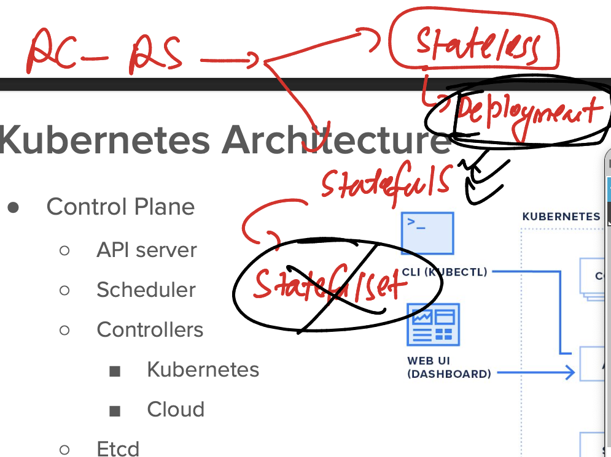

# JPMC-sparkawsEKS

### lets push image to Registry server 


## pushing image to docker hub 

### tagging 

```
docker  tag          ashujava:imgv1     docker.io/dockerashu/ashujava:imgv1
```

### loging to docker hub from docker server

```
[ashu@ip-172-31-95-164 ashu-pythoncode]$ docker  login  
Login with your Docker ID to push and pull images from Docker Hub. If you don't have a Docker ID, head over to https://hub.docker.com to create one.
Username: dockerashu
Password: 
WARNING! Your password will be stored unencrypted in /home/ashu/.docker/config.json.
Configure a credential helper to remove this warning. See
https://docs.docker.com/engine/reference/commandline/login/#credentials-store

Login Succeeded
```

### pushing image

```

[ashu@ip-172-31-95-164 ashu-pythoncode]$ docker push  docker.io/dockerashu/ashujava:imgv1  
The push refers to repository [docker.io/dockerashu/ashujava]
c591c838739a: Pushed 
5f70bf18a086: Mounted from library/sonarqube 
13c364d2fb9d: Pushed 
5229bd879601: Pushed 
56285d9a7760: Mounted from library/openjdk 
077bff59ce57: Mounted from library/openjdk 
9cd9df9ffc97: Mounted from library/openjdk 
imgv1: digest: sha256:a0243757199236d89d7a68acc59613eedfe6242dc8b5f0bdef9ee65020f900f4 size: 1781
```

### How to setuP EKS 


### to connect any K8S cluster (control plane) -- we need kubectl 

```
[ashu@ip-172-31-95-164 ashu-pythoncode]$ kubectl  version --client 
Client Version: v1.29.3
Kustomize Version: v5.0.4-0.20230601165947-6ce0bf390ce3
```

### for any OS  aws and EKS cred location 


### introduction to POd in k8s 


### testing control connection from kubectl 

```
ashu@ip-172-31-95-164 ~]$ kubectl  cluster-info 
Kubernetes control plane is running at https://F7F7ADBD02A3EC954AC1040B0F5D09F4.gr7.us-east-1.eks.amazonaws.com
CoreDNS is running at https://F7F7ADBD02A3EC954AC1040B0F5D09F4.gr7.us-east-1.eks.amazonaws.com/api/v1/namespaces/kube-system/services/kube-dns:dns/proxy


=====>>
[ashu@ip-172-31-95-164 ~]$ kubectl  version -o yaml 
clientVersion:
  buildDate: "2022-04-14T08:49:13Z"
  compiler: gc
  gitCommit: ad3338546da947756e8a88aa6822e9c11e7eac22
  gitTreeState: clean
  gitVersion: v1.23.6
  goVersion: go1.17.9
  major: "1"
  minor: "23"
  platform: linux/amd64
serverVersion:
  buildDate: "2024-03-02T03:46:53Z"
  compiler: gc
  gitCommit: f19f83c16ca534237fbfb65bc580d51752b98c91
  gitTreeState: clean
  gitVersion: v1.27.11-eks-b9c9ed7
  goVersion: go1.21.7
  major: "1"
  minor: 27+
  platform: linux/amd64
```

### pod manifest 

```
apiVersion: v1 
kind: Pod 
metadata: 
  name: ashupod1 
spec:  # under spec we put all pods component like storage , secu , containers etc
  containers: 
  - name: ashuc1
    image: docker.io/dockerashu/ashujava:imgv1 # image from docker hub 
    tty: True 
```

### sending create request

```
[ashu@ip-172-31-95-164 ashu-java-spark]$ ls
ashu-pythoncode  eks-manifest  javacode  sparkcode
[ashu@ip-172-31-95-164 ashu-java-spark]$ cd eks-manifest/
[ashu@ip-172-31-95-164 eks-manifest]$ ls
ashujavapod.yaml

[ashu@ip-172-31-95-164 eks-manifest]$ kubectl   create  -f   ashujavapod.yaml  
pod/ashupod1 created

[ashu@ip-172-31-95-164 eks-manifest]$ kubectl  get  pods
NAME             READY   STATUS         RESTARTS   AGE
ashupod1         1/1     Running        0          32s
```


### we can check output of pods 

```
[ashu@ip-172-31-95-164 ~]$ kubectl   logs  ashupod1 
```

### deleting pod 

```
 191  kubectl   delete  -f  ashujavapod.yaml 
  192  kubectl  get  po 
  193  kubectl  delete  pod  poojapod1

[ashu@ip-172-31-95-164 eks-manifest]$ kubectl  delete  pods --all
pod "avinashpod1" deleted
pod "humerapod1" deleted
pod "klnpod1" deleted
pod "manapod1" deleted
pod "nagapod1" deleted
pod "neelupod1" deleted
```

### incase code changes then 

```
  docker-compose up -d --build 
  202  history 
  203  docker-compose images
  204  docker  tag  ashujava:imgv1  docker.io/dockerashu/ashujava:imgv2
  205  docker login 
  206  docker push docker.io/dockerashu/ashujava:imgv2
  207  history 
  208  cd ../eks-manifest/
  209  ls
  210  kubectl  create -f  ashupod2.yml 
  211  kubectl  get po 
  212  history 
```

### Introduction to deployment controller 



### Creating pod file using kubectl 

```
ashu@ip-172-31-95-164 ~]$ kubectl  run   ashupod3  --image=docker.io/dockerashu/ashujava:imgv2  --dry-run=client  -o yaml 
apiVersion: v1
kind: Pod
metadata:
  creationTimestamp: null
  labels:
    run: ashupod3
  name: ashupod3
spec:
  containers:
  - image: docker.io/dockerashu/ashujava:imgv2
    name: ashupod3
    resources: {}
  dnsPolicy: ClusterFirst
  restartPolicy: Always
status: {}
[ashu@ip-172-31-95-164 ~]$ kubectl  run   ashupod3  --image=docker.io/dockerashu/ashujava:imgv2  --dry-run=client  -o yaml  >pod1.yaml
[ashu@ip-172-31-95-164 ~]$ ls
~  ashu-java-spark  cluster.yaml  config  pod1.yaml
[ashu@ip-172-31-95-164 ~]$ 


======>>
[ashu@ip-172-31-95-164 eks-manifest]$ kubectl  run   ashupod3  --image=docker.io/dockerashu/ashujava:imgv2  --dry-run=client  -o yaml   >ashunewfile.yml
[ashu@ip-172-31-95-164 eks-manifest]$ ls
ashujavapod.yaml  ashunewfile.yml  ashupod2.yml
[ashu@ip-172-31-95-164 eks-manifest]$ kubectl  create -f  ashunewfile.yml 
pod/ashupod3 created
[ashu@ip-172-31-95-164 eks-manifest]$ kubectl  get po 
NAME       READY   STATUS    RESTARTS   AGE
ashupod3   1/1     Running   0          3s
[ashu@ip-172-31-95-164 eks-manifest]$ kubectl delete -f ashunewfile.yml 
pod "ashupod3" deleted
[ashu@ip-172-31-95-164 eks-manifest]$ 
```

### Creating deployment manifest 

```
[ashu@ip-172-31-95-164 eks-manifest]$ kubectl  create   deployment   ashudeploy1  --image=docker.io/dockerashu/ashujava:imgv2 --dry-run=client    -o yaml 
apiVersion: apps/v1
kind: Deployment
metadata:
  creationTimestamp: null
  labels:
    app: ashudeploy1
  name: ashudeploy1
spec:
  replicas: 1
  selector:
    matchLabels:
      app: ashudeploy1
  strategy: {}
  template:
    metadata:
      creationTimestamp: null
      labels:
        app: ashudeploy1
    spec:
      containers:
      - image: docker.io/dockerashu/ashujava:imgv2
        name: ashujava
        resources: {}
status: {}
[ashu@ip-172-31-95-164 eks-manifest]$ kubectl  create   deployment   ashudeploy1  --image=docker.io/dockerashu/ashujava:imgv2 --dry-run=client    -o yaml   >ashu_deploy.yaml 
```

### update 

```
apiVersion: apps/v1 # new api version 
kind: Deployment # deployment controller 
metadata:
  creationTimestamp: null
  labels:
    app: ashudeploy1
  name: ashudeploy1 # name of deployment 
spec:
  replicas: 1 # number of pods we want 
  selector:
    matchLabels:
      app: ashudeploy1
  strategy: {}
  template:
    metadata:
      creationTimestamp: null
      labels:
        app: ashudeploy1
    spec:
      containers:
      - image: docker.io/dockerashu/ashujava:imgv2 # docker image 
        name: ashujava # name of container 
        resources: {}
status: {}

```


