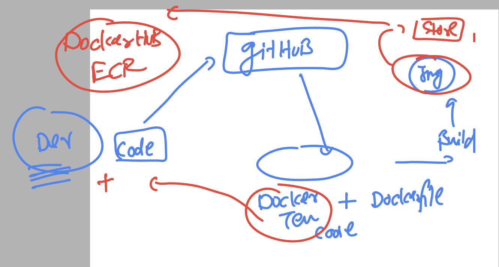
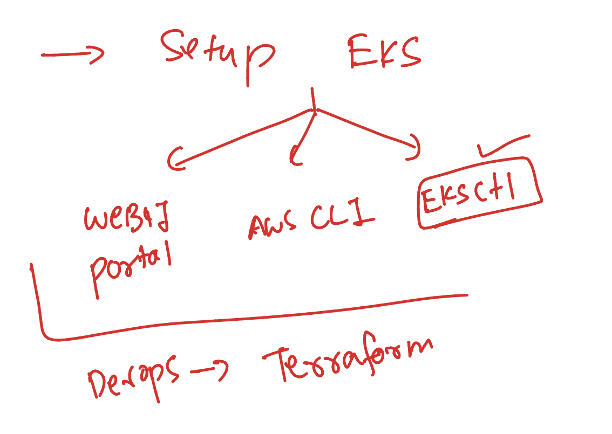
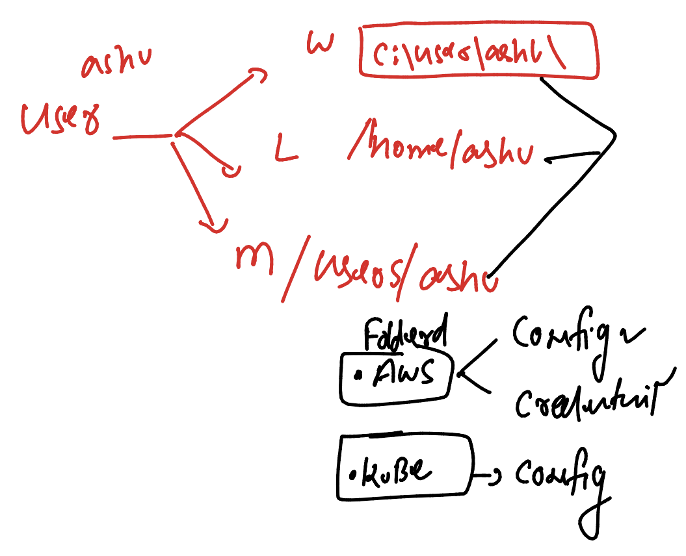
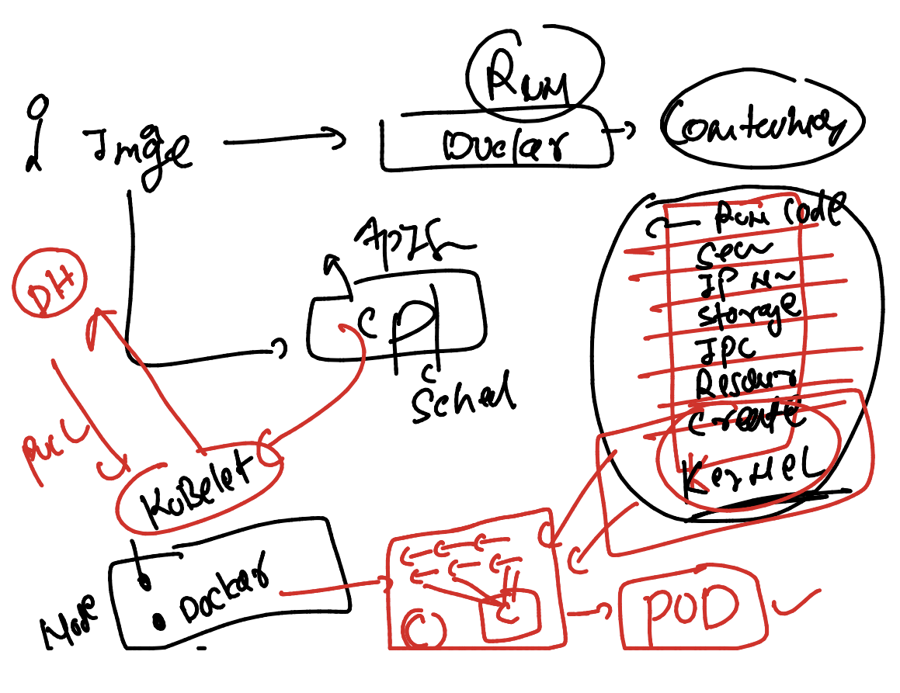

# JPMC-sparkawsEKS

### lets push image to Registry server 



## pushing image to docker hub 

### tagging 

```
docker  tag          ashujava:imgv1     docker.io/dockerashu/ashujava:imgv1
```

### loging to docker hub from docker server

```
[ashu@ip-172-31-95-164 ashu-pythoncode]$ docker  login  
Login with your Docker ID to push and pull images from Docker Hub. If you don't have a Docker ID, head over to https://hub.docker.com to create one.
Username: dockerashu
Password: 
WARNING! Your password will be stored unencrypted in /home/ashu/.docker/config.json.
Configure a credential helper to remove this warning. See
https://docs.docker.com/engine/reference/commandline/login/#credentials-store

Login Succeeded
```

### pushing image

```

[ashu@ip-172-31-95-164 ashu-pythoncode]$ docker push  docker.io/dockerashu/ashujava:imgv1  
The push refers to repository [docker.io/dockerashu/ashujava]
c591c838739a: Pushed 
5f70bf18a086: Mounted from library/sonarqube 
13c364d2fb9d: Pushed 
5229bd879601: Pushed 
56285d9a7760: Mounted from library/openjdk 
077bff59ce57: Mounted from library/openjdk 
9cd9df9ffc97: Mounted from library/openjdk 
imgv1: digest: sha256:a0243757199236d89d7a68acc59613eedfe6242dc8b5f0bdef9ee65020f900f4 size: 1781
```

### How to setuP EKS 



### to connect any K8S cluster (control plane) -- we need kubectl 

```
[ashu@ip-172-31-95-164 ashu-pythoncode]$ kubectl  version --client 
Client Version: v1.29.3
Kustomize Version: v5.0.4-0.20230601165947-6ce0bf390ce3
```

### for any OS  aws and EKS cred location 



### introduction to POd in k8s 




### testing control connection from kubectl 

```
ashu@ip-172-31-95-164 ~]$ kubectl  cluster-info 
Kubernetes control plane is running at https://F7F7ADBD02A3EC954AC1040B0F5D09F4.gr7.us-east-1.eks.amazonaws.com
CoreDNS is running at https://F7F7ADBD02A3EC954AC1040B0F5D09F4.gr7.us-east-1.eks.amazonaws.com/api/v1/namespaces/kube-system/services/kube-dns:dns/proxy


=====>>
[ashu@ip-172-31-95-164 ~]$ kubectl  version -o yaml 
clientVersion:
  buildDate: "2022-04-14T08:49:13Z"
  compiler: gc
  gitCommit: ad3338546da947756e8a88aa6822e9c11e7eac22
  gitTreeState: clean
  gitVersion: v1.23.6
  goVersion: go1.17.9
  major: "1"
  minor: "23"
  platform: linux/amd64
serverVersion:
  buildDate: "2024-03-02T03:46:53Z"
  compiler: gc
  gitCommit: f19f83c16ca534237fbfb65bc580d51752b98c91
  gitTreeState: clean
  gitVersion: v1.27.11-eks-b9c9ed7
  goVersion: go1.21.7
  major: "1"
  minor: 27+
  platform: linux/amd64
```


