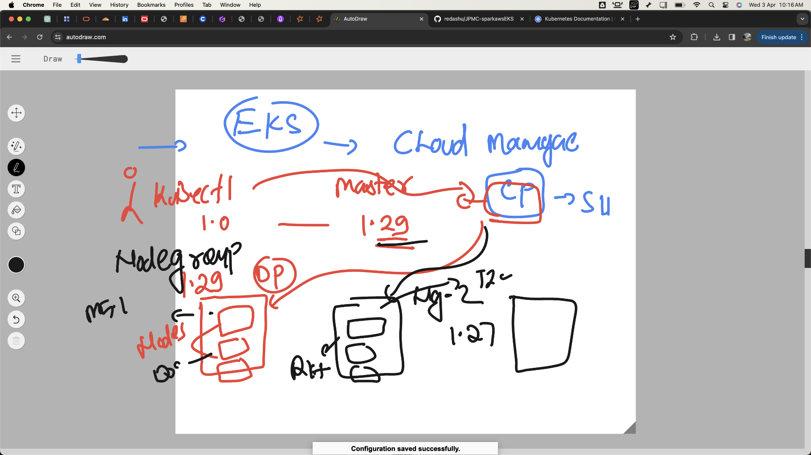
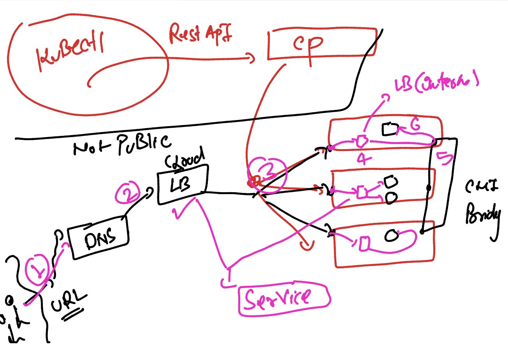
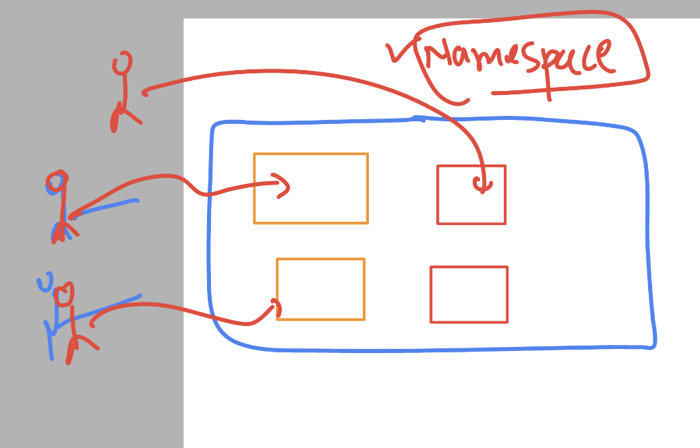
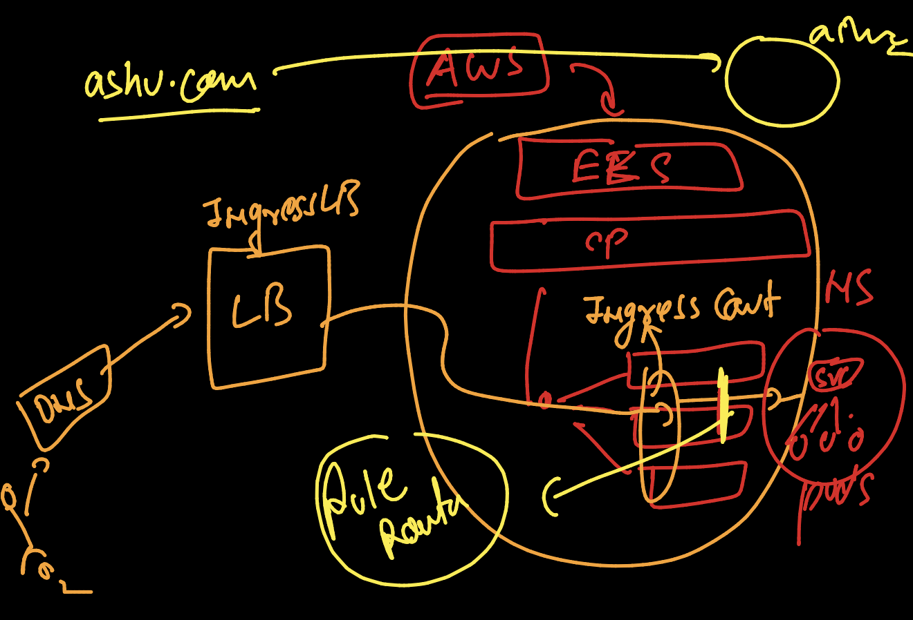
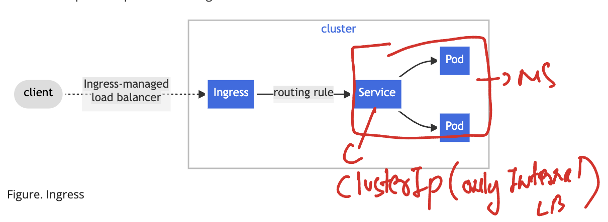
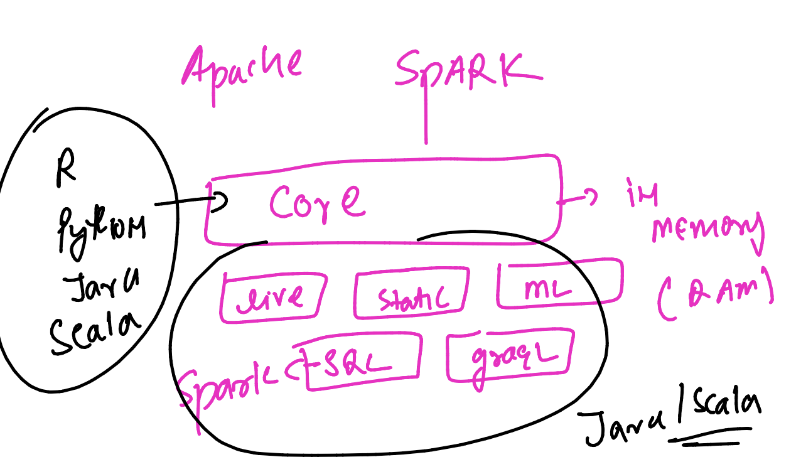
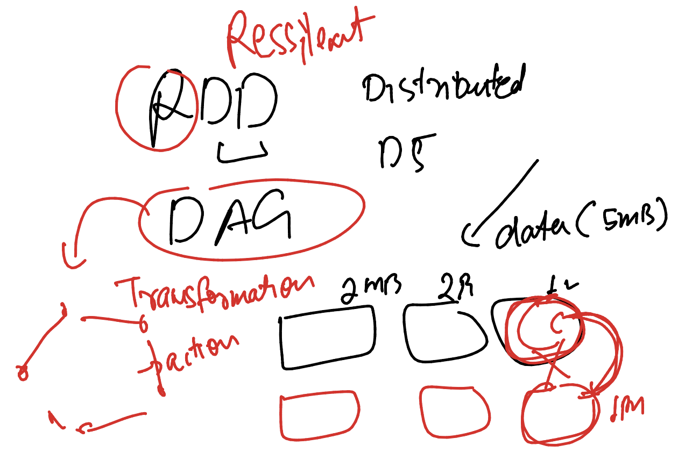

# JPMC-sparkawsEKS

### EKS more info 



### Network flow in EKS 



### verify k8s connection 

```
[ashu@ip-172-31-95-164 ashu-java-spark]$ kubectl  cluster-info 
Kubernetes control plane is running at https://F7F7ADBD02A3EC954AC1040B0F5D09F4.gr7.us-east-1.eks.amazonaws.com
CoreDNS is running at https://F7F7ADBD02A3EC954AC1040B0F5D09F4.gr7.us-east-1.eks.amazonaws.com/api/v1/namespaces/kube-system/services/kube-dns:dns/proxy

To further debug and diagnose cluster problems, use 'kubectl cluster-info dump'.
[ashu@ip-172-31-95-164 ashu-java-spark]$ kubectl  get nodes
NAME                            STATUS   ROLES    AGE   VERSION
ip-192-168-44-74.ec2.internal   Ready    <none>   35h   v1.27.9-eks-5e0fdde
ip-192-168-46-75.ec2.internal   Ready    <none>   38m   v1.27.9-eks-5e0fdde
ip-192-168-8-122.ec2.internal   Ready    <none>   38m   v1.27.9-eks-5e0fdde
[ashu@ip-172-31-95-164 ashu-java-spark]$ 

```

### lets create depoloyment file 

```
kubectl  create  deployment ashu-web-ui --image=dockerashu/ashujpmc:webv1  --port 80 --dry-run=client        -o yaml  >ashu-ui-deploy.yaml 
[ashu@ip-172-31-95-164 eks-manifest]$ ls
ashu_deploy.yaml  ashujavapod.yaml  ashunewfile.yml  ashupod2.yml  ashu-ui-deploy.yaml  svc_local.yaml  webdeploy.yaml
[ashu@ip-172-31-95-164 eks-manifest]$

====>>
ashu@ip-172-31-95-164 eks-manifest]$ kubectl apply  -f  ashu-ui-deploy.yaml  
deployment.apps/ashu-web-ui created
[ashu@ip-172-31-95-164 eks-manifest]$ kubectl  get deploy
NAME            READY   UP-TO-DATE   AVAILABLE   AGE
ashu-web-ui     1/1     1            1           8s
mukesh-web-ui   0/1     1            0           51s
prasadweb       1/1     1            1           9s
```

### Namespace in k8s



### Creating ns

```
kubectl  create   namespace  ashu-project  --dry-run=client -o yaml 
apiVersion: v1
kind: Namespace
metadata:
  creationTimestamp: null
  name: ashu-project
spec: {}
status: {}
➜  EKS kubectl  create   namespace  ashu-project                           
namespace/ashu-project created

```

### creating 

```
[ashu@ip-172-31-95-164 eks-manifest]$ kubectl  apply -f ashu-ui-deploy.yaml 
Warning: resource namespaces/ashu-project is missing the kubectl.kubernetes.io/last-applied-configuration annotation which is required by kubectl apply. kubectl apply should only be used on resources created declaratively by either kubectl create --save-config or kubectl apply. The missing annotation will be patched automatically.
namespace/ashu-project configured
deployment.apps/ashu-web-ui created
[ashu@ip-172-31-95-164 eks-manifest]$ 
[ashu@ip-172-31-95-164 eks-manifest]$ kubectl  apply -f ashu-ui-deploy.yaml 
namespace/ashu-project configured
deployment.apps/ashu-web-ui configured
[ashu@ip-172-31-95-164 eks-manifest]$ 
```

### chekcing 

```

➜  EKS kubectl get  deployment   --namespace  ashu-project
NAME          READY   UP-TO-DATE   AVAILABLE   AGE
ashu-web-ui   1/1     1            1           2m51s
➜  EKS 
➜  EKS 
➜  EKS kubectl get  deployment   -n  ashu-project
NAME          READY   UP-TO-DATE   AVAILABLE   AGE
ashu-web-ui   1/1     1            1           3m1s
➜  EKS 
➜  EKS 

```

### setting default namespace to your user

```
kubectl  config set-context --current --namespace=ashu-project   
```

### getting your current namesapce value

```
kubectl config get-contexts 
CURRENT   NAME                                                      CLUSTER                                                   AUTHINFO                                                  NAMESPACE
*         arn:aws:eks:us-east-1:751136288263:cluster/jpmc-cluster   arn:aws:eks:us-east-1:751136288263:cluster/jpmc-cluster   arn:aws:eks:us-east-1:751136288263:cluster/jpmc-cluster   ashu-project
[ashu@ip-172-31-95-164 eks-manifest]$ 
```

### creating it

```
ashu@ip-172-31-95-164 eks-manifest]$ kubectl   get  deploy
NAME          READY   UP-TO-DATE   AVAILABLE   AGE
ashu-web-ui   1/1     1            1           5m47s
[ashu@ip-172-31-95-164 eks-manifest]$ kubectl   expose  deployment  ashu-web-ui  --type LoadBalancer --port 80  --name ashu-lb  --dry-run=client  -o yaml  >lb.yaml 
[ashu@ip-172-31-95-164 eks-manifest]$ kubectl  apply -f lb.yaml 
service/ashu-lb created
[ashu@ip-172-31-95-164 eks-manifest]$ kubectl  get  svc
NAME      TYPE           CLUSTER-IP       EXTERNAL-IP                                                               PORT(S)        AGE
ashu-lb   LoadBalancer   10.100.144.153   a422c7eaf7f10464797e58531e049466-1381171794.us-east-1.elb.amazonaws.com   80:31602/TCP   4s
[ashu@ip-172-31-95-164 eks-manifest]$ 

```

### Ingress controller 



### more understanding 



## Introduction to apache spark 



### RDD and DAG  



### spark-dockerfie 

```
FROM  bitnami/spark
LABEL name="ashutoshh"
LABEL email="ashutoshh@linux.com"

```

### spark-compose 

```
version: '3.8'
services:
  ashu-spark-sdk:
    image: docker.io/dockerashu/spark:v1 
    build: .
    container_name: ashusparkc1
    tty: True 
```

### running it

```
[ashu@ip-172-31-95-164 ashu-java-spark]$ cd ashu-spark/
[ashu@ip-172-31-95-164 ashu-spark]$ ls
compose.yml  Dockerfile
[ashu@ip-172-31-95-164 ashu-spark]$ docker-compose  up -d 
WARN[0000] /home/ashu/ashu-java-spark/ashu-spark/compose.yml: `version` is obsolete 
[+] Running 5/5
 ✔ ashu-spark-sdk Pulled                                                                                   49.9s 
   ✔ 345e3491a907 Pull complete                                                                             0.4s 
   ✔ 57671312ef6f Pull complete                                                                             0.1s 
   ✔ 5e9250ddb7d0 Pull complete                                                                             0.1s 
   ✔ 1b957b2dec71 Pull complete                                                                            17.6s 
[+] Running 2/2
 ✔ Network ashu-spark_default  Created                                                                      0.1s 
 ✔ Container ashusparkc1       Started                                                                      0.2s 
[ashu@ip-172-31-95-164 ashu-spark]$ docker-compose  ps
WARN[0000] /home/ashu/ashu-java-spark/ashu-spark/compose.yml: `version` is obsolete 
NAME          IMAGE                           COMMAND   SERVICE          CREATED          STATUS          PORTS
ashusparkc1   docker.io/dockerashu/spark:v1   "bash"    ashu-spark-sdk   12 seconds ago   Up 10 seconds 
```

### accessing spark 

```

```
