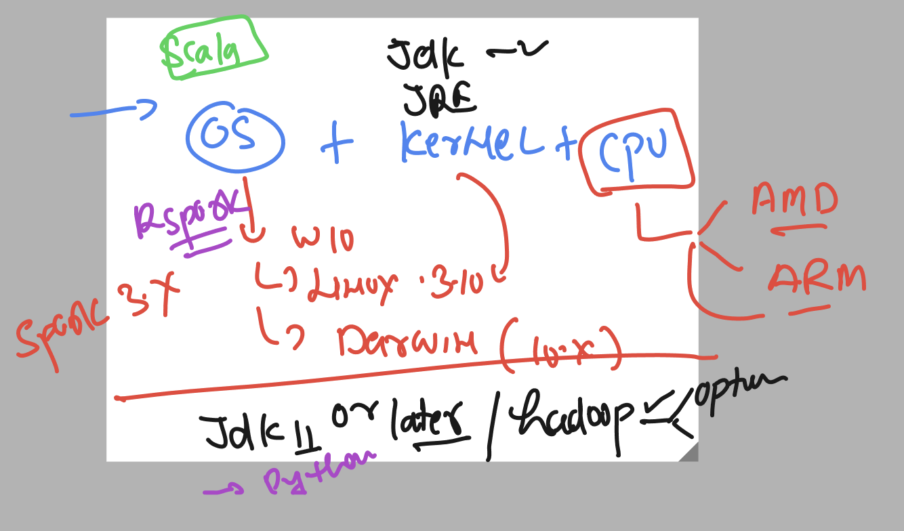

# JPMC-sparkawsEKS

### EKS rev


### spark rev 


### spark setup general context 



### installing jdk 11 or later -- 17 

```
[ashu@ip-172-31-95-164 ashu-java-spark]$ java --version 
openjdk 17.0.10 2024-01-16 LTS
OpenJDK Runtime Environment Corretto-17.0.10.8.1 (build 17.0.10+8-LTS)
OpenJDK 64-Bit Server VM Corretto-17.0.10.8.1 (build 17.0.10+8-LTS, mixed mode, sharing)
[ashu@ip-172-31-95-164 ashu-java-spark]$ ls
ashu-pythoncode  ashu-webapp   ingressrule.yaml  sparkcode    spark.yaml
ashu-spark       eks-manifest  javacode          spark_setup  svc1.yaml
[ashu@ip-172-31-95-164 ashu-java-spark]$ cd  spark_setup/
[ashu@ip-172-31-95-164 spark_setup]$ ls
[ashu@ip-172-31-95-164 spark_setup]$ 

```

### downloading setup 

```
 wget https://dlcdn.apache.org/spark/spark-3.5.1/spark-3.5.1-bin-hadoop3.tgz                    ] 21,364      --.-K/s   in 0.003s  

2024-04-04 05:20:36 (6.15 MB/s) - ‘spark-3.5.1-bin-hadoop3.tgz’ saved [21364]

[ashu@ip-172-31-95-164 spark_setup]$ ls  -lh  spark-3.5.1-bin-hadoop3.tgz 
-rw-rw-r-- 1 ashu ashu 21K Apr  4 05:20 spark-3.5.1-bin-hadoop3.tgz
[ashu@ip-172-31-95-164 spark_setup]$ 
```


### Extracting 

```
  history 
  565  tar -xvzf  spark-3.5.1-bin-hadoop3.tgz 
  566  history 
[ashu@ip-172-31-95-164 spark_setup]$ ls
spark-3.5.1-bin-hadoop3  spark-3.5.1-bin-hadoop3.tgz
[ashu@ip-172-31-95-164 spark_setup]$ rm  spark-3.5.1-bin-hadoop3.tgz 
```

### checking sprak config file

```
ashu@ip-172-31-95-164 spark_setup]$ ls
spark-3.5.1-bin-hadoop3
[ashu@ip-172-31-95-164 spark_setup]$ cd  spark-3.5.1-bin-hadoop3/
[ashu@ip-172-31-95-164 spark-3.5.1-bin-hadoop3]$ ls
bin  conf  data  examples  jars  kubernetes  LICENSE  licenses  NOTICE  python  R  README.md  RELEASE  sbin  yarn
[ashu@ip-172-31-95-164 spark-3.5.1-bin-hadoop3]$ cd  conf/
[ashu@ip-172-31-95-164 conf]$ ls
fairscheduler.xml.template  metrics.properties.template   spark-env.sh.template
log4j2.properties.template  spark-defaults.conf.template  workers.template
[ashu@ip-172-31-95-164 conf]$ 
[ashu@ip-172-31-95-164 conf]$ cp  spark-defaults.conf.template  spark-defaults.conf
[ashu@ip-172-31-95-164 conf]$ ls
fairscheduler.xml.template  metrics.properties.template  spark-defaults.conf.template  workers.template
log4j2.properties.template  spark-defaults.conf          spark-env.sh.template
[ashu@ip-172-31-95-164 conf]$ 

```

### Dockerfile  for spark 

```
FROM oraclelinux:8.4 
LABEL name="ashutoshh"
LABEL email="ashutoshh@linux.com"
ENV SPARK_SETUP=/opt/jpmc
ENV SPARK_VERSION=3.5.1
ENV JAVA_VERSION=17
# jdk 17 installing 
RUN dnf install java-${JAVA_VERSION}-openjdk java-${JAVA_VERSION}-openjdk-devel wget -y 
# dnf and yum are software installer in rpm based linux systems
WORKDIR ${SPARK_SETUP}
# changing location 
RUN wget https://dlcdn.apache.org/spark/spark-${SPARK_VERSION}/spark-${SPARK_VERSION}-bin-hadoop3.tgz
```

### building it

```
 docker build -t  dockerashu/spark:3.5.1 . 
```


### Spark in K8s 

### creating master deployment 

```
kubectl  create  deployment ashu-spark-master --image=docker.io/dockerashu/spark:v1   --port 8080 --namespace common  --dry-run=client  -o yaml  >spark_master_deploy.yaml
```

### creating worker 

```
kubectl  create  deployment ashu-spark-worker --image=docker.io/dockerashu/spark:v1  --namespace common  --dry-run=client  -o yaml
```

### master file

```
apiVersion: apps/v1
kind: Deployment
metadata:
  creationTimestamp: null
  labels:
    app: ashu-spark-master
  name: ashu-spark-master
  namespace: common
spec:
  replicas: 1
  selector:
    matchLabels:
      app: ashu-spark-master
  strategy: {}
  template:
    metadata:
      creationTimestamp: null
      labels:
        app: ashu-spark-master
    spec:
      containers:
      - image: docker.io/dockerashu/spark:v1
        name: spark
        ports:
        - containerPort: 8080
        env: # calling env of docker image
        - name: SPARK_MODE
          value: master # this pod will run as spark master 
        # - name: SPARK_MASTER_URL # not for spark master 
        #   value: spark://spark-master-lb:7077 
        resources: 
          requests:
            memory: 200M 
            cpu: 200m
          limits:
            memory: 600M
            cpu: 300m 
status: {}

```

### worker file 

```
apiVersion: apps/v1
kind: Deployment
metadata:
  creationTimestamp: null
  labels:
    app: ashu-spark-master
  name: ashu-spark-master
  namespace: common
spec:
  replicas: 1
  selector:
    matchLabels:
      app: ashu-spark-master
  strategy: {}
  template:
    metadata:
      creationTimestamp: null
      labels:
        app: ashu-spark-master
    spec:
      containers:
      - image: docker.io/dockerashu/spark:v1
        name: spark
        ports:
        - containerPort: 8080
        env: # calling env of docker image
        - name: SPARK_MODE
          value: woker # this pod will run as spark master 
         - name: SPARK_MASTER_URL # not for spark master 
         value: spark://spark-master-lb:7077 
        resources: 
          requests:
            memory: 200M 
            cpu: 200m
          limits:
            memory: 600M
            cpu: 300m 
status: {}

```
