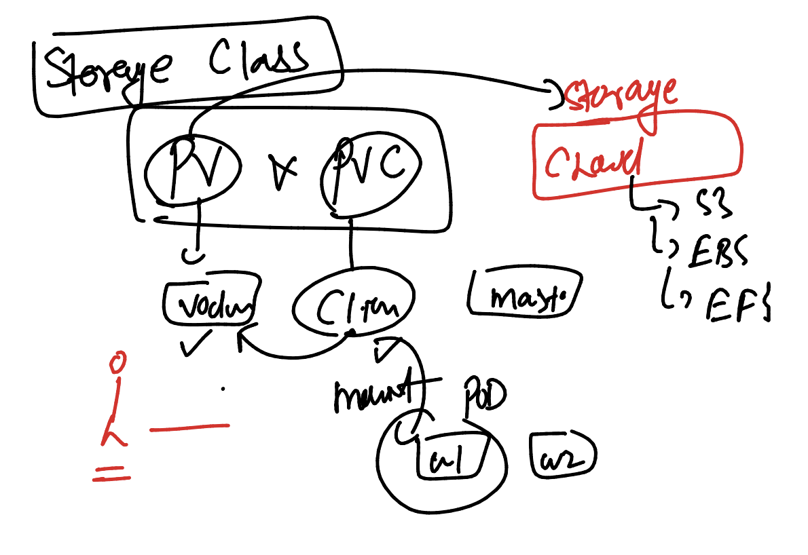

# JPMC-sparkawsEKS

### spark 


### Helm Version ---  after Helm v2 --- Helm v3 

```
helm version 
version.BuildInfo{Version:"v3.14.3", GitCommit:"f03cc04caaa8f6d7c3e67cf918929150cf6f3f12", GitTreeState:"clean", GoVersion:"go1.21.7"}
[ashu@ip-172-31-95-164 ashu-java-spark]$ 
```

### adding helm repo 

```
[ashu@ip-172-31-95-164 ashu-java-spark]$ helm repo add ashu-repo  https://charts.bitnami.com/bitnami 
"ashu-repo" has been added to your repositories
[ashu@ip-172-31-95-164 ashu-java-spark]$ 
[ashu@ip-172-31-95-164 ashu-java-spark]$ helm repo ls
NAME            URL                               
ashu-repo       https://charts.bitnami.com/bitnami
[ashu@ip-172-31-95-164 ashu-java-spark]$ 

```

### we can search charts in helm repo 

```
[ashu@ip-172-31-95-164 ashu-java-spark]$ helm search repo nginx 
NAME                                    CHART VERSION   APP VERSION     DESCRIPTION                                       
ashu-repo/nginx                         16.0.0          1.25.4          NGINX Open Source is a web server that can be a...
ashu-repo/nginx-ingress-controller      11.0.1          1.10.0          NGINX Ingress Controller is an Ingress controll...
ashu-repo/nginx-intel                   2.1.15          0.4.9           DEPRECATED NGINX Open Source for Intel is a lig...
[ashu@ip-172-31-95-164 ashu-java-spark]$ helm search repo tomcat 
NAME                    CHART VERSION   APP VERSION     DESCRIPTION                                       
ashu-repo/tomcat        11.0.0          10.1.20         Apache Tomcat is an open-source web server desi...
[ashu@ip-172-31-95-164 ashu-java-spark]$ helm search repo mysql
NAME                            CHART VERSION   APP VERSION     DESCRIPTION                                       
ashu-repo/mysql                 10.1.1          8.0.36          MySQL is a fast, reliable, scalable, and easy t...
ashu-repo/phpmyadmin            16.0.0          5.2.1           phpMyAdmin is a free software tool written in P...
ashu-repo/mariadb               18.0.1          11.3.2          MariaDB is an open source, community-developed ...
ashu-repo/mariadb-galera        13.0.0          11.3.2          MariaDB Galera is a multi-primary database clus...
[ashu@ip-172-31-95-164 ashu-java-spark]$ 

```

### deploy any chart

```
[ashu@ip-172-31-95-164 ashu-java-spark]$ helm   install   ashu-webapp  ashu-repo/nginx  
NAME: ashu-webapp
LAST DEPLOYED: Fri Apr  5 05:30:02 2024
NAMESPACE: common
STATUS: deployed
REVISION: 1
TEST SUITE: None
NOTES:
CHART NAME: nginx
CHART VERSION: 16.0.0
APP VERSION: 1.25.4
```

### checking it

```
ashu@ip-172-31-95-164 ashu-java-spark]$ kubectl  get  deploy
NAME                READY   UP-TO-DATE   AVAILABLE   AGE
ashu-webapp-nginx   1/1     1            1           73s
veda-webapp-nginx   0/1     1            0           1s
[ashu@ip-172-31-95-164 ashu-java-spark]$ kubectl  get  po
NAME                                 READY   STATUS    RESTARTS   AGE
ashu-webapp-nginx-547544855b-8f9rs   1/1     Running   0          81s
veda-webapp-nginx-859895889f-gf2p2   0/1     Running   0          10s
[ashu@ip-172-31-95-164 ashu-java-spark]$ kubectl  get  svc
NAME                TYPE           CLUSTER-IP       EXTERNAL-IP                                                              PORT(S)        AGE
ashu-webapp-nginx   LoadBalancer   10.100.158.138   a2a1fdc4b0a5247d98c9d797c7de8b5f-925721188.us-east-1.elb.amazonaws.com   80:31938/TCP   86s
raj-webapp-nginx    LoadBalancer   10.100.224.154   <pending>                                                                80:31111/TCP   0s
veda-webapp-nginx   LoadBalancer   10.100.16.82     a7c238e87aa6d45dfa5cdbf57d58759e-217533610.us-east-1.elb.amazonaws.com   80:30431/TCP   14s
[ashu@ip-172-31-95-164 ashu-java-spark]$ 
```


### Helm more command 

```
[ashu@ip-172-31-95-164 ashu-java-spark]$ helm  ls 
NAME            NAMESPACE       REVISION        UPDATED                                 STATUS          CHART           APP VERSION
ashu-webapp     common          1               2024-04-05 05:30:02.067818209 +0000 UTC deployed        nginx-16.0.0    1.25.4     
raj-webapp      common          1               2024-04-05 05:31:27.300352032 +0000 UTC deployed        nginx-16.0.0    1.25.4     
veda-webapp     common          1               2024-04-05 05:31:12.995185617 +0000 UTC deployed        nginx-16.0.0    1.25.4     
[ashu@ip-172-31-95-164 ashu-java-spark]$ helm  uninstall  ashu-webapp 
release "ashu-webapp" uninstalled
[ashu@ip-172-31-95-164 ashu-java-spark]$ 
```

## TIme for setting spark using helm 

```
ashu@ip-172-31-95-164 nginx]$ helm install spark-setup   ashu-repo/spark  
NAME: spark-setup
LAST DEPLOYED: Fri Apr  5 05:48:10 2024
NAMESPACE: common
STATUS: deployed
REVISION: 1
TEST SUITE: None
NOTES:
CHART NAME: spark
CHART VERSION: 9.0.0
APP VERSION: 3.5.1

** Please be patient while the chart is being deployed **

```

### here

```
shu@ip-172-31-95-164 ashu-java-spark]$ helm ls
NAME            NAMESPACE       REVISION        UPDATED                                 STATUS          CHART           APP VERSION
spark-setup     common          1               2024-04-05 05:48:10.019040989 +0000 UTC deployed        spark-9.0.0     3.5.1      
[ashu@ip-172-31-95-164 ashu-java-spark]$ kubectl  get  deploy
No resources found in common namespace.
[ashu@ip-172-31-95-164 ashu-java-spark]$ kubectl  get  sts
NAME                 READY   AGE
spark-setup-master   1/1     98s
spark-setup-worker   2/2     98s
[ashu@ip-172-31-95-164 ashu-java-spark]$ kubectl  get  statefulsets
NAME                 READY   AGE
spark-setup-master   1/1     2m30s
spark-setup-worker   2/2     2m30s
[ashu@ip-172-31-95-164 ashu-java-spark]$ 


```

### COMpiling java code 

```
[ashu@ip-172-31-95-164 mydemo]$ ls
pom.xml  src
[ashu@ip-172-31-95-164 mydemo]$ mvn install  
[INFO] Scanning for projects...
[INFO]                                                                         
[INFO] ------------------------------------------------------------------------
[INFO] Building ashudemo 1.0-SNAPSHOT
[INFO] ------------------------------------------------------------------------
[INFO] 
[INFO] --- maven-resources-plugin:2.5:resources (default-resources) @ ashudemo ---
[debug] execute contextualize
[WARNING] Using platform encoding (UTF-8 actually) to copy filtered resources, i.e. build is platform dependent!
[INFO] Copying 0 resource
[INFO] 
[INFO] --- maven-compiler-plugin:3.8.1:compile (default-compile) @ ashudemo ---
[INFO] Changes detected - recompiling the module!
[WARNING] File encoding has not been set, using platform encoding UTF-8, i.e. build is platform dependent!
[INFO] Compiling 2 source files to /home/ashu/ashu-java-spark/mydemo/target/classes
[INFO] 
[INFO] --- maven-resources-plugin:2.5:testResources (default-testResources) @ ashudemo ---
[debug] execute contextualize
[WARNING] Using platform encoding (UTF-8 actually) to copy filtered resources, i.e. build is platform dependent!
[INFO] skip non existing resourceDirectory /home/ashu/ashu-java-spark/mydemo/src/test/resources
[INFO] 
[INFO] --- maven-compiler-plugin:3.8.1:testCompile (default-testCompile) @ ashudemo ---
[INFO] Changes detected - recompiling the module!
[WARNING] File encoding has not been set, using platform encoding UTF-8, i.e. build is platform dependent!
[INFO] 
[INFO] --- maven-surefire-plugin:2.10:test (default-test) @ ashudemo ---
[INFO] Surefire report directory: /home/ashu/ashu-java-spark/mydemo/target/surefire-reports

-------------------------------------------------------
 T E S T S
-------------------------------------------------------

Results :

Tests run: 0, Failures: 0, Errors: 0, Skipped: 0

[INFO] 
[INFO] --- maven-jar-plugin:2.3.2:jar (default-jar) @ ashudemo ---
[INFO] Building jar: /home/ashu/ashu-java-spark/mydemo/target/ashudemo-1.0-SNAPSHOT.jar
[INFO] 
[INFO] --- maven-install-plugin:2.3.1:install (default-install) @ ashudemo ---
[INFO] Installing /home/ashu/ashu-java-spark/mydemo/target/ashudemo-1.0-SNAPSHOT.jar to /home/ashu/.m2/repository/com/example/ashudemo/1.0-SNAPSHOT/ashudemo-1.0-SNAPSHOT.jar
[INFO] Installing /home/ashu/ashu-java-spark/mydemo/pom.xml to /home/ashu/.m2/repository/com/example/ashudemo/1.0-SNAPSHOT/ashudemo-1.0-SNAPSHOT.pom
[INFO] ------------------------------------------------------------------------
[INFO] BUILD SUCCESS
[INFO] ------------------------------------------------------------------------
[INFO] Total time: 33.422s
[INFO] Finished at: Fri Apr 05 06:39:05 UTC 2024
[INFO] Final Memory: 49M/200M
[INFO] ------------------------------------------------------------------------
[ashu@ip-172-31-95-164 mydemo]$ ls
pom.xml  src  target
[ashu@ip-172-31-95-164 mydemo]$ ls  target/
ashudemo-1.0-SNAPSHOT.jar  generated-sources       maven-archiver  surefire
classes                    generated-test-sources  maven-status    test-classes
```

### Spark job submission modes 


### Statefulsets




